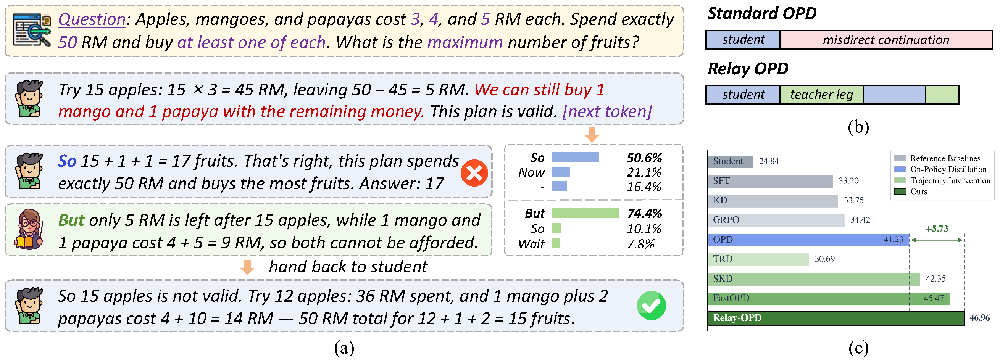

<div align="center">

#  Pass the Baton: Trajectory-Relayed On-Policy Distillation

[](https://zju-real.github.io/Relay-OPD/)
[](#)
[](#)

<strong>Haolei Xu<sup>1,2&#42;</sup> · Xiaowen Xu<sup>2&#42;</sup> · Haiwen Hong<sup>2&#42;&dagger;</sup> · Zixuan Ni<sup>1</sup></strong><br>
<strong>Hongxing Li<sup>1,2</sup> · Yiwen Qiu<sup>1</sup> · Weiming Lu<sup>1&Dagger;</sup> · Yongliang Shen<sup>1</sup></strong>

<sup>1</sup>Zhejiang University &nbsp; <sup>2</sup>Yuvion Team, Alibaba Group

<sup>&#42;</sup>Equal contribution &nbsp; <sup>&dagger;</sup>Project leader &nbsp; <sup>&Dagger;</sup>Corresponding author

</div>

---

**Relay-OPD** fixes *prefix failure* in on-policy distillation. A label-free **handoff trigger** — the teacher's top-1 token is a reflection token while no reflection token appears in the student's top-K — locates failed prefixes online during student generation. The teacher then briefly takes over for a short **teacher leg** of L paragraphs, hands the trajectory back, and a limited **relay budget (M, L)** keeps intervention early and local. The entire rollout runs in a single speculative decoding engine (student as draft model, teacher as target model), and the student is optimized on the relayed trajectory, including the relay tokens themselves.

With a Qwen3-4B-Instruct-2507 teacher and Qwen3-0.6B/1.7B-Non-Thinking students on eight mathematical reasoning benchmarks, Relay-OPD achieves the best or second-best result on every benchmark — **+5.73%** over standard OPD and **+1.49%** over the strongest baseline FastOPD on average at 1.7B — while cutting average training trajectory length by **more than 50%**.

<div align="center">

</div>

## News

- **2026-07** — Preprint and project page released. Code is being cleaned up and will be available soon.

## Links

- 📄 Paper: arXiv link coming soon
- 🌐 Project page: <https://zju-real.github.io/Relay-OPD/>

## Citation

```bibtex
@misc{xu2026relayopd,
  title={Pass the Baton: Trajectory-Relayed On-Policy Distillation},
  author={Haolei Xu and Xiaowen Xu and Haiwen Hong and Zixuan Ni and Hongxing Li and Yiwen Qiu and Weiming Lu and Yongliang Shen},
  year={2026},
  url={https://github.com/zju-real/Relay-OPD},
}
```
